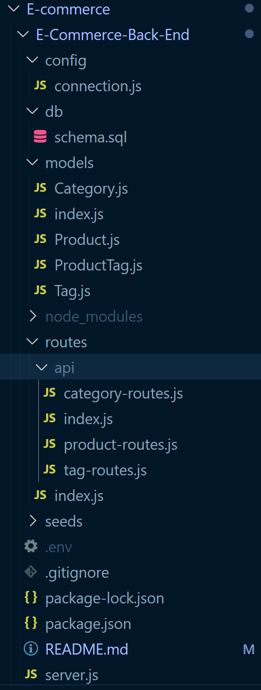
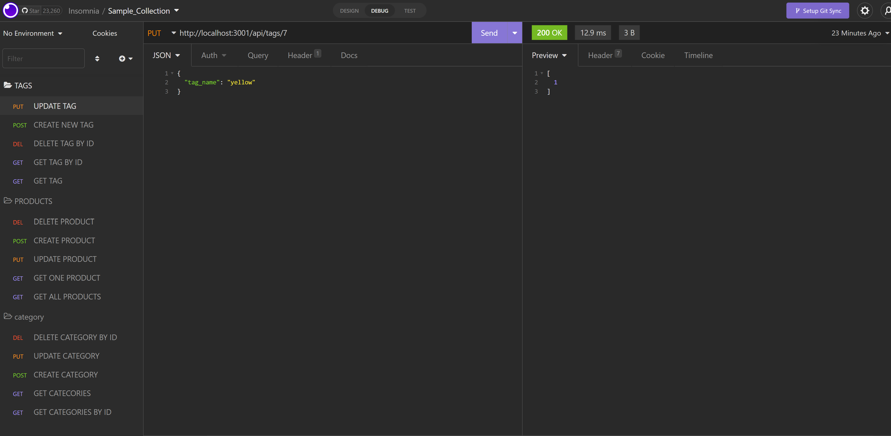

# Title of the Project:

# E-Commerce-Back-End

## Description:

## _# E-Commerce-Back-End made with Node.js, express.js, and mysql. Using insomnia, i was able to test all the routes (GET, POST, PUT, and DELETE) to the three tables (Category, Product, and Tag) in mqsql.

## Table of Content:

1. [Installation Instructions](#installation)
2. [Usage Information](#usage)
3. [License Information](#License)
4. [Contribution](#contributing)
5. [Tests](#tests)
6. [Questions](#questions)

## installation:

## 1. run command "npm i in root folder to install dependancies"

## 2. run command "node index.js"

## 3. tesing the routes using insomnia

## Usage:

## to be used for practicing creating models, relationships between the tables, and routes.

## License: N/A

## contributing:

## Built solo

## Tests:

## N/A

## Questions:

you can finde my GitHub at:

## [wasim202](https://github.com/wasim202)

If you have any questions please email me at:

## wsmohd87@gmail.com

## [Video link](https://drive.google.com/file/d/1yqONJDlNsAW2SGttebk6VffVBrjZk387/view)
